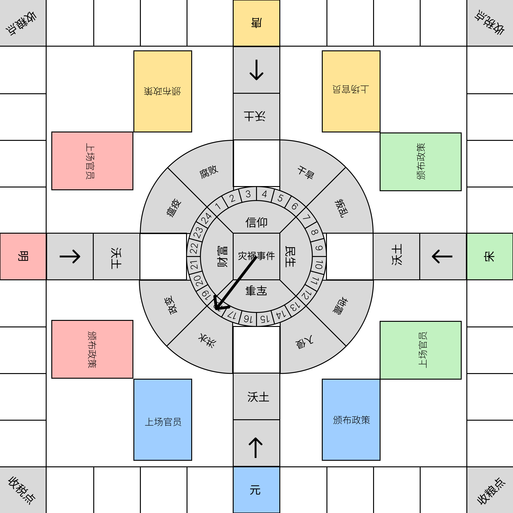
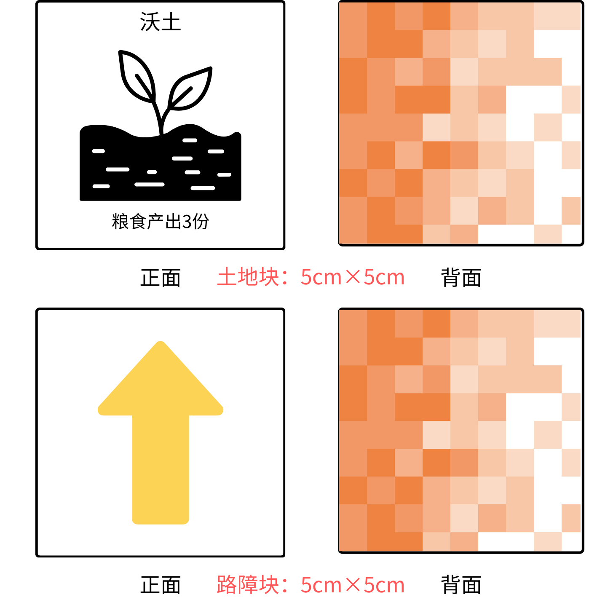

# 地图与地块

  

    
    
大地图

  

  

    
    
地块板示例

  

* 大地图×1
* 土地块×24：沃土×4，平地×12，瘠土×8
* 路障块×12

| 土地格类型 | 说明文字 | 编号 |
| --- | --- | --- |
| 沃土 | 粮食产出3份 | 3，9，15，21 |
| 平地 | 粮食产出2份 | 1~24剩余编号 |
| 瘠土 | 粮食产出1份 | 1，5，7，11，13，17，19，23 |
